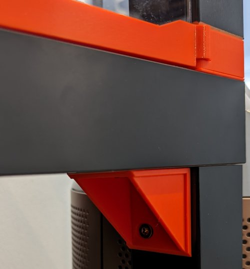
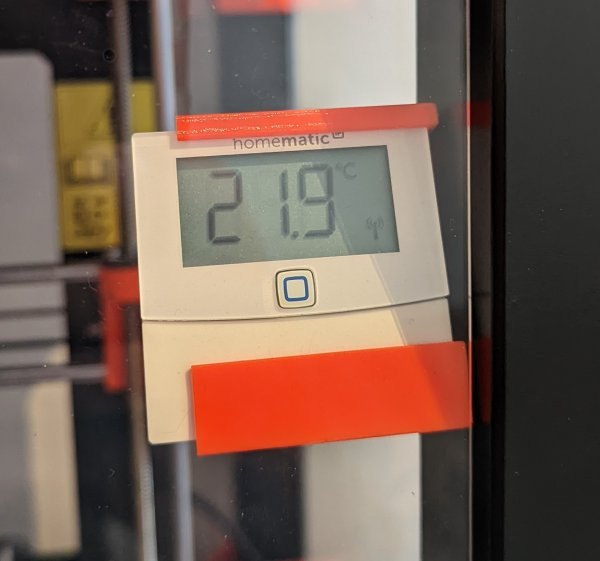

# Parts for 3D printing

## Filament testing body

A sample print that contains some challenges for printer and the used material.
Contains overhangs, objects close together (stringing) and preparations for drilling holes and pins for metrics screws & nuts of different sizes.

[Filament testing body](./3d_print_filament_testing_body.stl)

## Angle piece for "Ikea lack" printer enclosure

This is a small extension for the awesome printer enclosure using Ikea lack tables and
printed parts from [this design](https://www.thingiverse.com/thing:3085211).
As one of the tables act as a base and it's a bit unsteady when the printer is working hard,
I added an angle piece to increase rigidity of the base.

[Angle piece for lack table](./angle_piece_for_lack_table.stl)

## Connector for Homematic IP temperature and humidity sensor

As for some prints the environment temperature matters, I thought its a good idea to add a temperature sensor
inside the enclosure.

[Desgin preview](./holder_homeatic_ip_temperature_sensor.stl)
