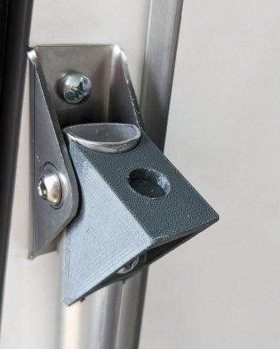

# CAR parts

## VW Caddy Maxi Reimo Camper

### Seat support for original aluminum tube

For heavy people like me the aluminum seat tube might tend to slip away, resulting into a bended tube top.
To avoid this, I decided to add an additional support, on top of the tube where it connects to the seat.

[Seat support for aluminum tube](./vw_caddy_reimo_concept_seat_support.stl)

Printed with: PETG, 0,2mm, PrusaSlicer Defaults

### Seat support for replacement 20mm steel tube

For some extra safety I decided to replace the aluminum tube by a 20mm steel tube (2mm thickness).
In addtion, I've added the support on it (even if probably not required)

[Seat support for steel tube](./vw_caddy_reimo_concept_seat_support_20mm_steel_tube.stl)

Printed with: PETG, 0,2mm, PrusaSlicer Defaults
